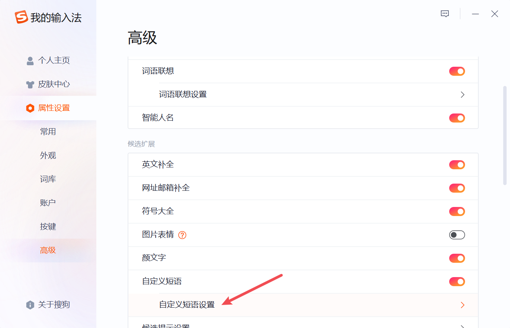

# 搜狗emoji自定义词库

## emoji

网站 Emojipedia 创始人 Jeremy Burge 曾经这样说过，“ emoji 能让我们的个性在文字对话中得以表达”。是的，没有什么文字比图片来得更加直接了。

emoji 从日本开创，美国发展，已经能被大多数现代计算机系统所兼容的Unicode编码采纳，比如在 Typora 可以简单地用 `:smile:` 来表达 emoji，一般情况 emoji 都是英文检索

那么问题在于怎样在电脑上用**中文输入**emoji表情

简单搜索后发现，输入 emoji 的方式有：

1. win10 及以上自带的 `win + .` 或者 `win + ;` 
2. 从 emoji 站（像 [EmojiAll中文](https://www.emojiall.com/zh-hans) ）复制粘贴
3. uTools 里的emoji插件

## 思路

但是使用后感觉还是不够便捷，于是想到个办法：把常用的 emoji 作为自定义短语配置到搜狗输入法中

这样一来符合自己的输入法习惯，二来还能根据需要自由定制触发词

搜狗输入法`自定义短语设置`加入已设定好 emoji，可行！

## 设置

先从 [一把刀《中文字典》📕 ](https://zhongwenzidian.18dao.cn/emoji) 拷贝带有中文释义的 emoji 

进行筛选得到常用的表情和简化的释义

然后把中文转拼音方便中文检索，调整成自定义短语设置的格式

比如 `🍗:家禽的腿` 不太符合日常习惯，把这改为 `鸡腿` ，最终转为 `jitui,3=🍗` ，这样在我们输入`jitui` 时候选框中就会出现🍗

最后只要在搜狗输入法中设置好，就能开始用啦

打开后在最下面复制粘贴好，保存

## 其他个人配置

[单字.txt](https://github.com/U1805/Sogou-emoji-thesaurus/blob/main/其他个人使用配置/搜狗拼音_win_小鹤音形_单字.txt) 和 [符号.txt](https://github.com/U1805/Sogou-emoji-thesaurus/blob/main/其他个人使用配置/搜狗拼音_win_小鹤音形_单字.txt) 是对 [小鹤音形·搜狗拼音win版自定义短语.txt](http://flypy.ysepan.com/) 的拆分，没有任何额外修改，仅个人存档使用

[颜文字小表情.txt](https://github.com/U1805/Sogou-emoji-thesaurus/blob/main/其他个人使用配置/颜文字小表情.txt) 是我收集的一些颜表情，像是 •ᴗ• ´◡` ˙˘˙ ᐛ ⍢

[直角引号.html](https://github.com/U1805/Sogou-emoji-thesaurus/blob/main/其他个人使用配置/如何输入直角引号「」.html) 是通过修改配置文件，将搜狗拼音默认的中文方括号【】修改为直角括号「」的方法，[原链接点这里](https://www.zhihu.com/question/19755746/answer/2234244508)
